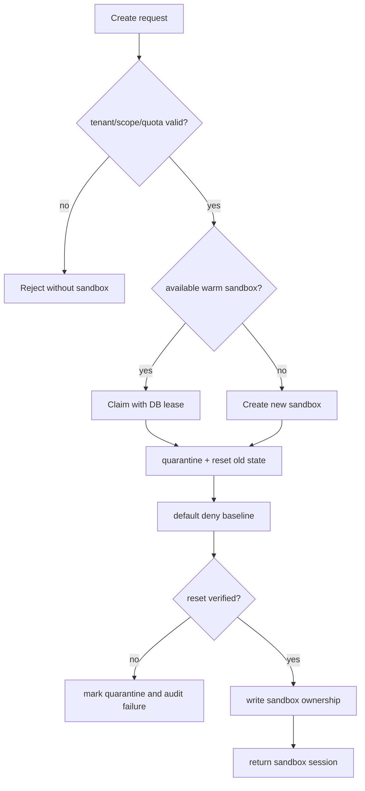
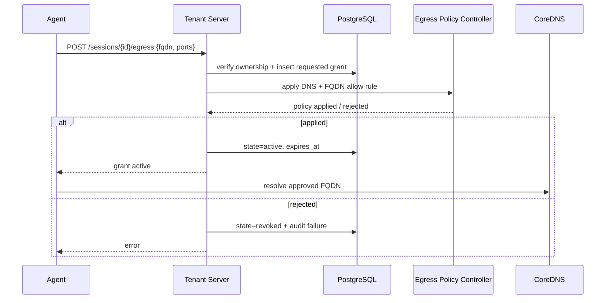
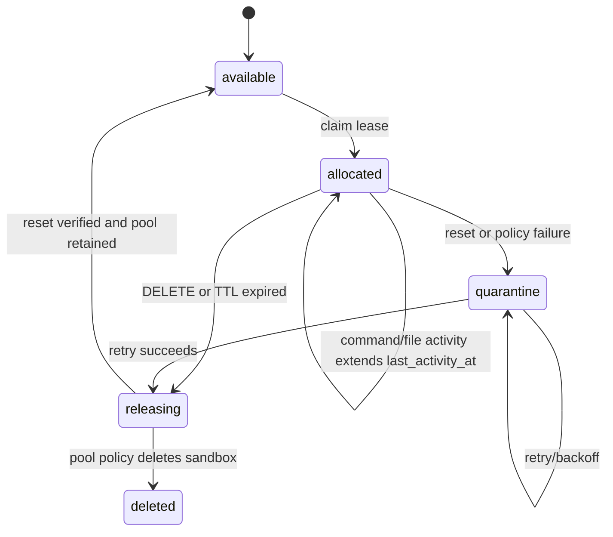

# OpenSandbox Tenant Server 架構

## 1. 目標

OpenSandbox Tenant Server 位於外部 client 與 OpenSandbox Server 之間，提供一個不需要
暴露 Kubernetes API credential，也不需要把 OpenSandbox Server key 發給使用者
的多租戶入口。

```text
Client / Agent
     |
     | tenant key
     v
OpenSandbox Tenant Server ×3
  - tenant authentication
  - quota / scope
  - sandbox ownership
  - warm-pool claim
  - egress policy
  - streaming proxy
  - tenant metrics
     |
     | one private server credential
     v
OpenSandbox Server
     |
     v
Warm Pool / Sandbox Pods
```

OpenSandbox Server 只負責 sandbox lifecycle 與 runtime 操作；tenant identity、
權限、配額與 audit context 由 Tenant Server 管理。

## 2. Tenant Server 必須提供的效果

### Tenant isolation

- 每個 tenant 使用自己的 tenant key。
- Tenant Server 只儲存 tenant key 的 hash，不儲存明文 key。
- API request 先解析 tenant，再執行 scope 與 quota 檢查。
- sandbox 建立後記錄 `sandbox_id -> tenant_id` ownership。
- tenant 只能 list、command、upload、download、delete 自己的 sandbox。
- OpenSandbox Server 的共同 server key 永遠不下發給 client。

### OpenSandbox API compatibility

Tenant Server 對外維持 OpenSandbox `/v1/...` API 形式，並在內部注入 server credential。
可以採用 allowlist，而不是無條件轉發所有路徑：

- sandbox create / list / get / delete
- lifecycle operations
- command proxy
- file upload / download proxy
- 明確拒絕 `/snapshot`、`/snapshots` 與未知 API

Upload、download 與 command output 必須採 streaming，並設定 request body、
response body、timeout 與 concurrency 上限，避免 Tenant Server 自身成為記憶體瓶頸。

## 3. End-to-end workflows

### 3.1 Tenant onboarding 與 key rotation

Tenant 建立和正常 sandbox request 是兩條不同的權限路徑。管理者只把 admin
credential 提供給內部管理面；一般 tenant 永遠只使用自己的 bearer key。

```mermaid
sequenceDiagram
    actor Operator
    participant TS as Tenant Server
    participant DB as PostgreSQL
    participant Secret as Secret Manager
    Operator->>TS: POST /admin/tenants
    TS->>DB: INSERT tenant + key_hash + scopes + quota
    DB-->>TS: committed
    TS-->>Operator: tenant_key (shown once)
    Operator->>Secret: store tenant_key
    Note over TS,DB: future replicas read the same state
    Operator->>TS: disable or rotate tenant
    TS->>DB: update enabled / key_hash / version
    DB-->>TS: committed
    Note over TS: no Deployment restart; next request uses new state
```

### 3.2 Normal request admission

所有 `/v1/...` request 都先經過相同的 admission pipeline。任何一個檢查失敗都
在呼叫 OpenSandbox 前結束，避免未授權 request 產生 side effect。

```text
request
  |
  +--> parse Bearer key
  +--> hash key and load enabled tenant
  +--> resolve route -> required scope
  +--> check request size / rate / tenant quota
  +--> for sandbox ID: verify sandbox_ownership(tenant_id, sandbox_id)
  +--> attach request_id and tenant metrics
  +--> allowlisted OpenSandbox proxy with server credential
  +--> stream response and update last_activity_at
```

### 3.3 Warm-pool claim、reset 與交付

warm pool 的重點不是單純預先建立 Pod，而是每次 claim 前都要消除前一個 tenant
留下的 ownership、檔案與 egress 狀態。claim、reset、ownership commit 應具有可重試
的狀態機；同一個 request 重送時不能產生兩筆 active ownership。



實際的安全順序是：

1. 先取得 tenant quota 與 pool lease，避免多副本同時認領同一個 sandbox。
2. 將 sandbox 標記為 `quarantine`，暫時不讓 client 使用。
3. 清除前一個 tenant 的 egress grants、DNS 規則、session metadata 與 workspace。
4. 套用 default-deny baseline；預設不允許 DNS 或外部 egress。
5. 驗證 reset 結果，再寫入新的 `sandbox_ownership` 與 `allocation_state=allocated`。
6. 若任一步失敗，保留 quarantine 狀態並由補償工作重試，不把半清理的 sandbox 交付。

### 3.4 Egress request 與 FQDN lifecycle

Sandbox 初始不具備 DNS 流量。Tenant Server 先驗證 tenant 是否擁有 sandbox，再驗證
FQDN 格式、port、租戶 allowlist 與 grant TTL，最後才建立可追蹤的 policy change。



規則回收不依賴 client 是否正常關閉網頁：DELETE、TTL expiry、server restart recovery
與 pool release 都會執行同一個 idempotent revoke/reset 流程。當該 sandbox 已沒有
active FQDN grant 時，DNS allow 也一併移除。

### 3.5 Command、upload、download 的 streaming flow

Tenant Server 不把大型檔案或長時間 command output 全部讀進 memory。每一個 stream
都要套用 body limit、idle timeout、overall timeout、client disconnect cancellation
與 concurrency quota。

```text
Agent
  -> authenticated command/upload/download request
  -> Tenant Server admission + ownership check
  -> OpenSandbox stream
  -> copy chunks while enforcing limits
  -> client disconnect cancels upstream context
  -> record bytes / duration / status, never record content
```

### 3.6 TTL、release 與故障補償



TTL worker 必須以 PostgreSQL row lock 或 lease version 搶工作；因此三個 Tenant Server
replica 同時掃描 expired rows 時只有一個可以執行 release。所有 transition 都要有
audit event，讓 operator 能分辨「正常 TTL 回收」與「因 egress reset 失敗而隔離」。

### 3.7 Multi-replica request 與資料流

```text
Client
  -> NodePort / private node IP
       +--> Tenant Server replica 1 --+
       +--> Tenant Server replica 2 ---+--> PostgreSQL read-write Service
       +--> Tenant Server replica 3 --+          |
                                             ownership / tenant / grants
                                                    |
                                             OpenSandbox Server
```

Tenant Server 不使用本地檔案保存租戶狀態，也不把 request sticky session 當成一致性
機制。任何 replica 都能處理下一個 request；一致性由 PostgreSQL transaction、ownership
constraint 與 lease version 提供。

## 4. DB 的責任

Tenant Server 需要一個 durable state store。這個 DB 不只是存 tenant key，也應該保存
跨請求需要的 ownership、egress、quota 與 audit 狀態。

### Tenant

```text
tenant_id
key_hash
enabled
scopes
max_concurrent_sandboxes
max_request_bytes
created_at
updated_at
rotated_at
display_name
client_id
last_authenticated_at
status_reason
```

`key_hash` 使用不可逆雜湊；新增 tenant 時只回傳一次明文 key。停用 tenant
不需要重啟 Tenant Server，之後的新 request 立即被拒絕。

Tenant 的資料分成四類：身份（`tenant_id`、`display_name`、`client_id`）、
credential 狀態（只有 `key_hash`、key version、rotation time，絕不保存明文 key）、
授權與資源限制（`scopes`、sandbox/concurrency、request/file bytes quota），以及
營運狀態（enabled、建立/更新/最後驗證時間與停用原因）。明文 tenant key 只在
建立或輪替時回傳一次，由呼叫端的 secret manager 保存。

### Sandbox ownership

```text
sandbox_id
tenant_id
pool_name
allocation_state       # creating / allocated / released / expired
claimed_at
last_activity_at
released_at
```

這張表用來阻止 tenant A 操作 tenant B 的 sandbox，也讓 Tenant Server 能將
OpenSandbox / Kubernetes resource metrics 透過 `sandbox_id` 關聯回 tenant。

### Egress grants

```text
grant_id
sandbox_id
tenant_id
fqdn
ports
state                  # requested / active / revoked / expired
requested_at
expires_at
revoked_at
```

`tenant_id` 與 `sandbox_id` 必須同時驗證，避免拿到 sandbox ID 後修改別人的
egress policy。FQDN 必須經過格式與 allowlist 驗證，不接受任意 URL、IP、CIDR
或 wildcard。

### Audit events

```text
event_id
tenant_id
sandbox_id
action
request_id
result
created_at
metadata
```

建議記錄 tenant create、key rotate、sandbox claim/release、egress allow/revoke、
quota rejection 與被拒絕的 API route，但不要將 tenant key、檔案內容或 command
secret 寫入 audit log。

## 5. Warm pool 與 egress 的整合

Warm pool 的 Pod 可能會被不同 tenant 依序使用，因此 claim 不是單純把一個
sandbox ID 回傳給 client，而是一個需要 transaction 與安全清理的流程。

```text
1. Tenant Server 收到 create request
2. 驗證 tenant、scope 與 quota
3. 認領 warm-pool sandbox；沒有可用資源才建立新的 sandbox
4. 建立 sandbox ownership record
5. reset egress policy
6. 套用 baseline policy：default deny、必要的 control-plane access
7. 確認 reset 成功後才回傳 sandbox
```

如果 egress reset 失敗，Tenant Server 必須將 sandbox 標記為 `quarantine`，不能交付
給 tenant。

### Egress state machine

```text
NO_EGRESS
  - default deny
  - 不允許 DNS

DNS_ENABLED
  - 只允許 sandbox -> CoreDNS
  - 尚未允許任何外部 FQDN

FQDN_ENABLED
  - 允許 CoreDNS
  - 只允許 tenant 已申請的 FQDN / port
```

初始 claim、release 與 TTL expiry 都應該執行 reset：

```text
default deny
remove all old FQDN grants
remove DNS access when no active FQDN grants remain
```

第一次呼叫 egress allow API 時，Tenant Server 才補上 CoreDNS rule 與指定 FQDN rule。
只要仍有 active FQDN grant，就必須持續允許 CoreDNS，否則 FQDN 動態解析與
refresh 會失敗。

## 6. Request flow

### 建立 sandbox

```text
Client
  -> Authorization: Bearer tenant-key
  -> Tenant Server 查 tenant DB
  -> quota check
  -> claim pool / create sandbox
  -> ownership DB transaction
  -> egress reset
  -> OpenSandbox response
```

### 執行 command 或檔案操作

```text
Client request
  -> tenant authentication
  -> ownership check
  -> scope check
  -> OpenSandbox proxy
  -> stream response
  -> update last_activity_at / metrics
```

### 回收 sandbox

```text
DELETE / TTL expiry / pool release
  -> revoke all active egress grants
  -> reset egress policy
  -> release sandbox to pool or delete it
  -> mark ownership released
  -> emit audit event
```

## 7. Tenant metrics

Tenant Server 是最可靠的 tenant metrics 邊界，因為 request 進入時已經完成 tenant
authentication。建議提供：

```text
opensandbox_tenant_server_requests_total{tenant,method,route,status}
opensandbox_tenant_server_sandboxes_created_total{tenant}
opensandbox_tenant_server_sandboxes_deleted_total{tenant}
opensandbox_tenant_server_active_sandboxes{tenant}
opensandbox_tenant_server_commands_total{tenant}
opensandbox_tenant_server_uploaded_bytes_total{tenant}
opensandbox_tenant_server_downloaded_bytes_total{tenant}
opensandbox_tenant_server_quota_rejections_total{tenant}
```

OpenSandbox Server 原生 metrics 不會自動知道 tenant。若需要 tenant 維度的
CPU、memory、Pod churn，應透過 `sandbox_id -> tenant_id` ownership mapping，
把 Tenant Server metadata 與 Kubernetes metrics 做 recording rule 或額外 exporter
關聯。不要直接把任意 request path 或 sandbox ID 當成 Prometheus label，避免
高 cardinality。

## 8. Store 選擇

### PostgreSQL HA

正式多副本架構使用 PostgreSQL HA，而不是三個互相獨立的 PostgreSQL Pod。
建議使用 CloudNativePG 管理三個 PostgreSQL instances：一個 primary、兩個
replicas，由 operator 提供 read-write Service、failover、replication 與各自的
PVC。Tenant Server 永遠連線 operator 管理的 read-write Service，不直接連特定
PostgreSQL Pod。

```text
OpenSandbox Tenant Server ×3
          |
          v
PostgreSQL read-write Service
          |
   PostgreSQL HA ×3
   primary + 2 replicas
```

租戶與 ownership state 都必須寫入 PostgreSQL；Tenant Server 不依賴本地檔案或
本地 PVC。資料庫故障轉移時，connection pool 應使用 retry/backoff 重新建立連線。

目前環境已先部署 PostgreSQL shared state，正式 HA migration 應以 CloudNativePG
Cluster resource 取代單一 PostgreSQL Deployment。CloudNativePG 官方也建議
應用程式連接 operator 管理的 Service，而不是固定某個資料庫 instance。

### SQLite

只適合單一 Tenant Server、小型 cluster 與 prototype。需要 PVC，並使用 transaction
保護 tenant 與 ownership 狀態。若未來 Tenant Server replicas 大於一個，應改成 shared
database 或使用 leader/locking 設計。

### Vault

適合 production tenant credential、key rotation 與多副本 Tenant Server。Tenant Server 透過
Kubernetes auth 取得短期 Vault token，使用短 cache 讀取 tenant records；Vault
資料變更不需要重啟 Tenant Server。

### ConfigMap

適合 development 或唯讀設定快照。Tenant Server 可監看檔案變更並 reload，但不適合
保存明文 tenant key，也不適合 ownership、egress grant 或高頻 audit state。

建議的演進順序：

```text
SQLite + PVC
  -> PostgreSQL shared state
  -> PostgreSQL HA ×3 / managed PostgreSQL
  -> Vault 保存 credential，PostgreSQL 保存 operational state
```

## 9. 目前部署邊界

- Go OpenSandbox Tenant Server ×3 對外提供 tenant-aware API。
- OpenSandbox Server 保持 ClusterIP-only。
- Tenant Server 使用三個節點的 private host IP `18080`，Service 對外保留 NodePort `30081`。
- Tenant Server metrics 由 Prometheus ServiceMonitor scrape。
- Grafana 依 `tenant` label 顯示 API、session、command 與 transfer usage。
- OpenSandbox Server 的 server credential 不會下發給 tenant。

## 10. 重要安全原則

1. tenant key 只顯示一次，遺失就 rotate，不提供明文查詢。
2. egress reset 失敗時不得交付 warm-pool sandbox。
3. 不讓外部 client 取得 Kubernetes API 權限。
4. 任何 sandbox 操作都必須同時通過 tenant authentication 與 ownership check。
5. Tenant Server DB、Prometheus 與 audit log 不應保存 command secret 或檔案內容。
6. Production 應加入 TLS、rate limit、per-tenant quota、DB backup 與 key rotation。

## 11. 測試與驗收 workflow

每次 Go code、Docker image、Kubernetes manifest、DB schema、authentication 或
egress policy 變更，都依序執行：

```text
go test -race -count=1 ./...
  -> build immutable image
  -> import image to every node
  -> kubectl apply + rollout status
  -> tenant-server-smoke.sh
  -> optional CHECK_K8S=1 CHECK_PROMETHEUS=1
  -> inspect Grafana / Prometheus target
```

目前 smoke test 會驗證 health、三副本、每個 private node endpoint、metrics tenant
label、unauthenticated rejection、temporary tenant lifecycle、disabled tenant rejection、
snapshot deny 與 Prometheus 三個 target；並在成功或失敗時清理 temporary tenant。
不會創建 sandbox，因此可以在 production-like 環境反覆執行。真正涉及 sandbox 的
integration test 必須使用專用測試 tenant 與 disposable pool，完成後確認 ownership、
egress grant、Pod 與檔案都已清理。

## 12. 實作檔案

- Go Tenant Server：[main.go](tenant-server-go/main.go)
- Go module：[go.mod](tenant-server-go/go.mod)
- immutable runtime image：[Dockerfile](tenant-server-go/Dockerfile)
- PostgreSQL HA target：[postgres-ha.yaml](k8s/postgres-ha.yaml)
- Tenant Server deployment：[tenant-server.yaml](k8s/tenant-server.yaml)
